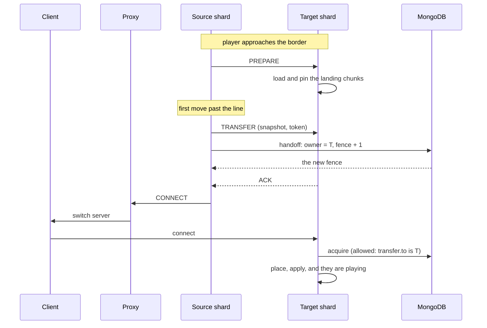

A crossing is a MongoDB write, a message, and a proxy switch. The work is in the ordering.

## The player is never frozen

An earlier version cancelled every move while a handoff was in flight. That is the rubber-banding: the client keeps walking, every move is rejected, and it is yanked back several times a tick.

Instead the crossing step is allowed through. The player stands for a few milliseconds on a block this shard does not own, which is harmless because the region guard refuses every block action outside the region regardless of who is standing where. A leash only intervenes if they get somewhere they genuinely should not be.

## Position is sent twice

The snapshot's position is taken at the border step and is out of date by the whole length of the handoff. So the source sends a second, later update at commit, and then keeps sending updates every few ticks until the player actually leaves. The destination places them from the freshest one it has and extrapolates over the remaining gap using the recorded velocity, vertically as well as horizontally.

Without the vertical part, a player who crosses mid-jump or mid-fall is placed at the height they were a third of a second ago. That is the drop people describe as a second jump at the border.

## The client keeps its world

A server switch normally makes the client throw its world away and rebuild it, which is the terrain loading screen. Three things prevent it:

<AccordionGroup>
  <Accordion title="The entity id travels with the player" icon="fingerprint">
    The proxy will only suppress the rebuild if the destination reuses the id the client already holds. Player ids are allocated from a reserved range far above anything a server hands to a mob, so a collision is impossible rather than merely unlikely.
  </Accordion>
  <Accordion title="The login teleport is neutralised" icon="location-crosshairs">
    The destination ends its login by telling the client where it is, and the client obeys absolutely. That packet is rewritten on its way out into a relative no-op, so the client keeps the position it already has and corrects the server on its next movement report instead of the other way round.
  </Accordion>
  <Accordion title="Stale entities are cleared" icon="broom">
    Because the respawn packet is suppressed, the client keeps every mob and item the previous shard sent it, and the new shard never knew they existed. The source lists them in the handoff and the destination removes them before its own tracker sends anything.
  </Accordion>
</AccordionGroup>

## Opening the connection early

The expensive half of a switch is the backend login, and it has nothing to do with the player having crossed. With `pre-open` enabled, the shard tells every proxy to start the connection while the player is still walking toward the border. The destination parks it in the configuration phase, after the registries and before the player entity exists, and releases it the moment the handoff commits.

<Warning>
This is off by default. Its first deployment made every crossing fail, and a border that is merely slow beats one that cannot be walked.
</Warning>

## When it goes wrong

| Failure | What happens |
| --- | --- |
| Target does not acknowledge | The handoff is reverted, the player is nudged back inside, and they can try again. |
| Target already claimed them | Nothing to revert. This connection is stale, so it is kicked and the reconnect lands on the right shard. |
| Proxy never switches them | The same revert, unless the handoff is already committed, in which case they are kicked to reconnect. |
| The database write never returns | After four timeouts the transfer is given up on and the player is kicked, because we cannot know whether the write landed. |
