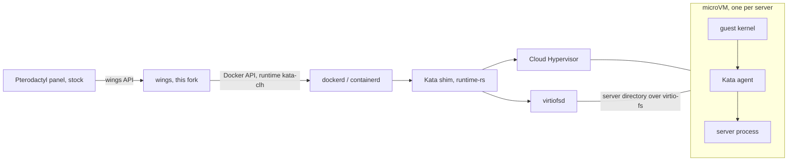

This wings build runs every server, installer and script container in its own lightweight virtual machine, using [Kata Containers](https://katacontainers.io) with the [Cloud Hypervisor](https://www.cloudhypervisor.org) VMM. It is a fork of [Calagopus wings](https://github.com/calagopus/wings) and replaces the wings binary on a node as it is: the stock Pterodactyl panel 1.15.x, eggs, Docker images, allocations, the file manager, SFTP, backups and disk limits keep working without changes.

## Containers share the host kernel

Any kernel bug that code inside a container can reach is a way out of that container. Two disclosed in 2026 are reachable from an unprivileged one:

| CVE | Name | What a server owner gets |
| --- | --- | --- |
| CVE-2026-31431 | Copy Fail | Writes into the page cache of any file the container can read, including setuid binaries and image layers that other containers share. A deterministic container escape. |
| CVE-2026-43499 | GhostLock | A futex flaw that ends in root on the host. |

On a game host the code inside those containers belongs to your customers: the plugins, mods and install scripts they upload. A kernel update closes each bug once it is public, and the next one is the same class of bug.

## One kernel per server

Each server boots its own Linux guest kernel, with its own page cache, futexes and syscall table. Exploiting that kernel gets an attacker the inside of one VM, which holds the same files they could already reach with that server's SFTP login. Reaching the host or another server then takes a second bug in one of these:

- KVM
- Cloud Hypervisor's virtio devices (Rust, seccomp filtered)
- virtiofsd, which serves the server directory to the VM (Rust, in its own namespaces, seccomp filtered)
- the Kata runtime-rs shim, which parses the agent's replies over vsock (Rust)

<Warning>
  That is a far smaller attack surface than the host kernel's syscall table, and it is still not zero. Keep the host kernel, KVM and Kata patched.
</Warning>

## Changes in wings

Wings keeps its Docker executor. A server is still a Docker container built from the egg's image. The fork chooses the OCI runtime that starts it, and changes what wings does around a VM:

| | Container (stock) | MicroVM (this fork) |
| --- | --- | --- |
| Kernel | shared with the host | one guest kernel per server |
| `/proc/meminfo`, `nproc` | host values, or lxcfs | the server's own limits |
| Memory, CPU and PID limits | host cgroup | guest cgroup, with the VM sized to the limit |
| DNS | Docker's embedded resolver on 127.0.0.11 | the servers in `docker.network.dns`, written to `/etc/resolv.conf` |
| Panel stats | host cgroup of the container | Docker stats API, read from inside the guest |
| CFS burst | host cgroup | not applied |
| lxcfs | optional | skipped |
| `/dev/kvm` passthrough | supported | not passed through |
| `docker.network.mode: host` | supported | refused at boot |

The panel talks to the same wings API, so the panel is not modified at all. A `config.yml` from `wings configure` or from the panel's Configuration tab works unchanged, and wings picks the Kata runtime on its own once Kata is installed.

<CardGroup cols={2}>
  <Card title="Requirements" icon="list-check" href="/wings/requirements">
    Hardware virtualization, Docker, and the memory each VM costs.
  </Card>
  <Card title="Installation" icon="download" href="/wings/installation">
    Kata on the node, the wings binary, and checking it worked.
  </Card>
  <Card title="Configuration" icon="gear" href="/wings/configuration">
    Opting out, failing closed, and the Kata settings.
  </Card>
  <Card title="Benchmarks" icon="chart-line" href="/wings/benchmarks">
    The Paper egg on runc and on Kata, through the stock panel.
  </Card>
</CardGroup>
